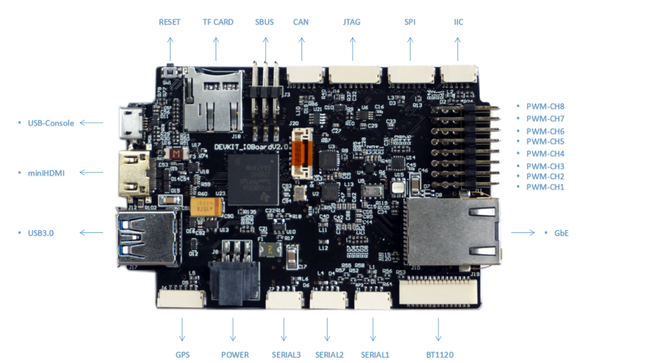
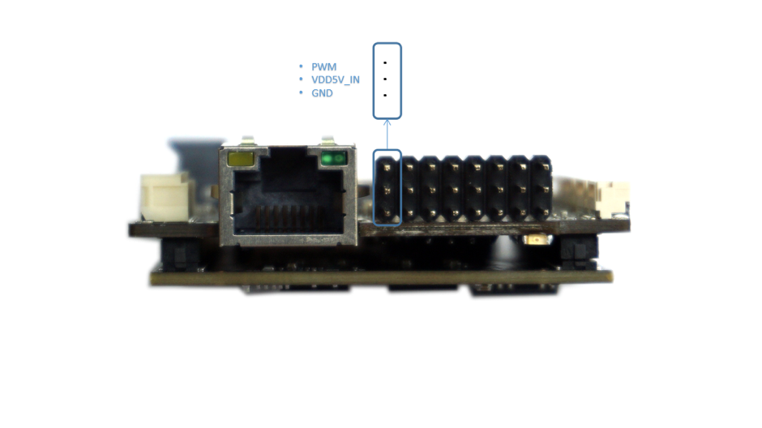
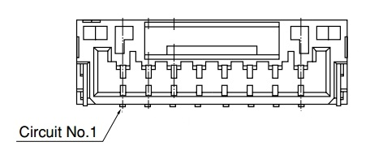
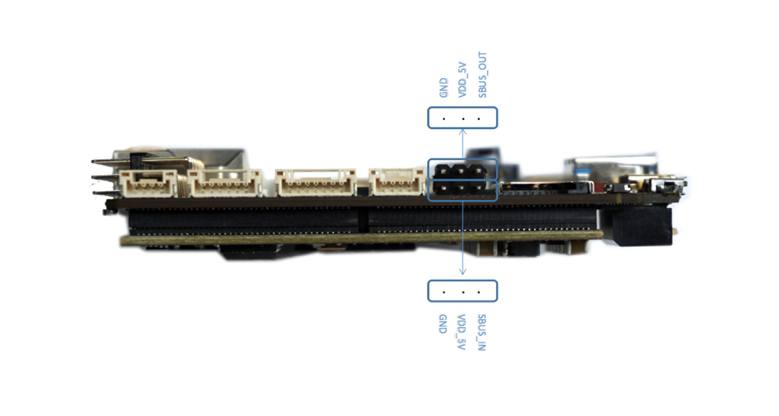
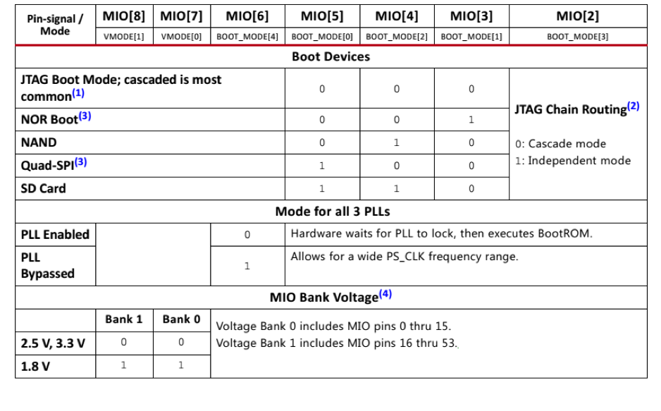

# 1. Hardware interface introduction

## 1.1. GH connector pin sequence description

The connectors used for PhenixPRO flight control, in addition to USB-TYPEA, MiniHDMI, Cameralink, TF socket, MircoUSB using the standard connector, the rest are used GH connector . The picture is a diagram of the GH connector,, the first foot on the left is defined as PIN1, all GH form interface on PhenixPRO are defined in this order.

## 1.2. POWER

| Pin | Definition | Notes |
| :--- | :--- | :--- |
| 1 | VDD\_5V | 5V Power input，Imax 1A |
| 2 | VDD\_5V | 5V Power input，Imax 1A |
| 3 | Current Detect |  |
| 4 | Voltage Detect |  |
| 5 | GND |  |
| 6 | GND |  |

## 1.3. JTAG

PhenixPRO provides JTAG debugging interface, using 7Pin GH connector, pin definition is as follows:

| Pin | Definition | Notes |
| :--- | :--- | :--- |
| 1 | TMS |  |
| 2 | TDI |  |
| 3 | TDO |  |
| 4 | TCK |  |
| 5 | GND |  |
| 6 | VDD3V3 |  |
| 7 | RST |  |

## 1.4. IIC

PhenixPRO provides an IIC expansion interface, using 4Pin GH connector, the pin is defined as follows:

| Pin | Definition | Notes |
| :--- | :--- | :--- |
| 1 | VDD\_5V\_OUT | 5V Power Output |
| 2 | PS\_IIC0\_SCL | 3.3V logic level |
| 3 | PS\_IIC0\_SDA | 3.3V logic level |
| 4 | GND |  |

## 1.5. SPI

PhenixPRO provides a SPI expansion interface, using 6Pin GH connector, the pin is defined as follows:

| Pin | Definition | Notes |
| :--- | :--- | :--- |
| 1 | VDD\_5V\_OUT | 5V Power Output |
| 2 | PS\_SPI1\_SCLK | 3.3V logic level |
| 3 | PS\_SPI1\_MISO | 3.3V logic level |
| 4 | PS\_SPI1\_MOSI | 3.3V logic level |
| 5 | PS\_SPI1\_SS0 | 3.3V logic level |
| 6 | GND |  |

## 1.6. Data Radio

PhenixPRO provides a data radio interface, using UART communication, 4Pin GH connector, pin is defined as follows:

| Pin | Definition | Notes |
| :--- | :--- | :--- |
| 1 | VDD\_5V\_OUT | 5V Power Output |
| 2 | UART\_TX | PL\_Bank35\_6N，3.3V logic level |
| 3 | UART\_RX | PL\_Bank35\_6P，3.3V logic level |
| 4 | GND |  |

## 1.7. UART

PhenixPRO provides two UART expansion interfaces, using 4Pin GH connector, the pin is defined as follows:

UART1：

| Pin | Definition | Notes |
| :--- | :--- | :--- |
| 1 | VDD\_5V\_OUT | 5V Power Output |
| 2 | UART1\_TX | PL\_Bank13\_19N，3.3V logic level |
| 3 | UART1\_RX | PL\_Bank13\_19P，3.3V logic level |
| 4 | GND |  |

UART2：

| [Pin]() | Definition | Notes |
| :--- | :--- | :--- |
| 1 | VDD\_5V\_OUT | 5V Power Output |
| 2 | UART2\_TX | PL\_Bank34\_1N，3.3V logic level |
| 3 | UART2\_RX | PL\_Bank34\_1P，3.3V logic level |
| 4 | GND |  |

## 1.8. CAN

PhenixPRO provides a CAN expansion interface, using 4Pin GH connector, the pin is defined as follows:

| Pin | Definition | Notes |
| :--- | :--- | :--- |
| 1 | VDD\_5V\_OUT | 5V Power Output |
| 2 | PS\_CAN0\_H |  |
| 3 | PS\_CAN0\_L |  |
| 4 | GND |  |

## 1.9. GPS

PhenixPRO provides all the way GPS expansion interface, the interface uses the UART interface, while providing an IIC for external compass. The interface uses a 6Pin GH connector, the pin definition is as follows:  

| Pin | Definition | Notes |
| :--- | :--- | :--- |
| 1 | VDD\_5V\_OUT | 5V Power Output |
| 2 | GPS\_UART\_TX | PL\_Bank35\_10N，3.3V logic level |
| 3 | GPS\_UART\_RX | PL\_Bank35\_10P，3.3V logic level |
| 4 | GPS\_IIC\_SCL | PL\_Bank35\_9N，3.3V logic level |
| 5 | GPS\_IIC\_SDA | PL\_Bank35\_9P，3.3V logic level |
| 6 | GND |  |

## 1.10. PWM Electronic Governor

[PhenixPRO provides eight-way PWM form of electrical governor interface, unified use of 2.54mm pitch header. Each PWM pin is defined as follows:]

## 1.11.SBUS

PhenixPRO provides a SBUS input, a SBUS output interface, using 2.54mm pin spacing leads. Specific definitions are as follows:

## 1.12.Console

PhenixPRO provides a console interface for printing program running information. The interface uses UART communication, the interface leads to two forms. One through the onboard serial to USB chip, through the form of MircoUSB leads, users can directly use USB to connect the computer. Another way through the GH connector, through the form of UART leads.

| Pin | Definition | Notes |
| :--- | :--- | :--- |
| 1 | VDD\_5V\_OUT | 5V Power Output |
| 2 | PS\_UART1\_TX | 3.3V logic level |
| 3 | PS\_UART1\_RX | 3.3V logic level |
| 4 | GND |  |

## 1.13.BOOT mode configuration switch

PhenixPRO provides a switch for configuring the BOOTmode. Defined as follows:

| Pin | Definition | Notes |
| :--- | :--- | :--- |
| 1 | MIO0 | ON : LOW This pin Default ON |
| 2 | [BOOT\_MODE\[3\]] |  |
| 3 | BOOT\_MODE\[1\] |  |
| 4 | BOOT\_MODE\[2\] |  |
| 5 | BOOT\_MODE\[0\] |  |
| 6 | BOOT\_MODE\[4\] |  |

Specific configuration information see below, the board currently supports SD card to start.

