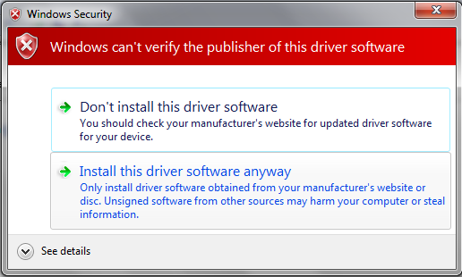
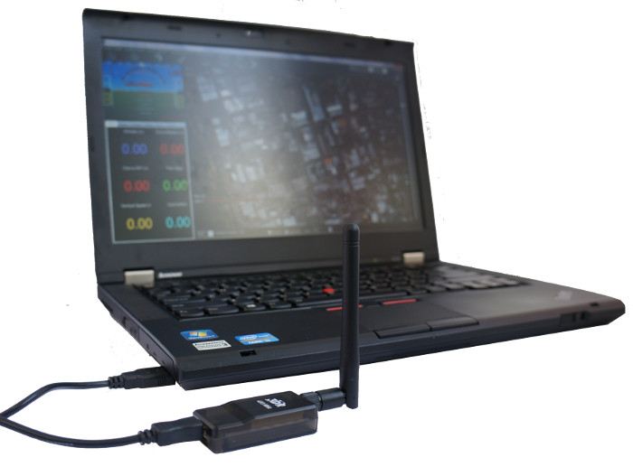
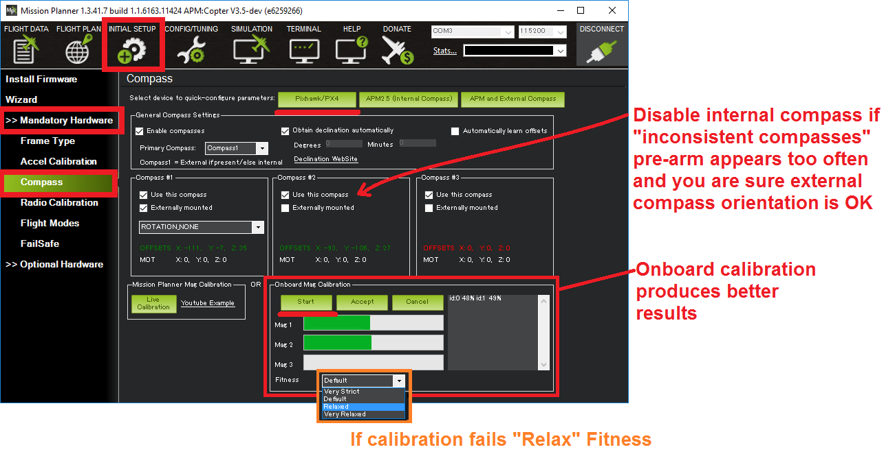
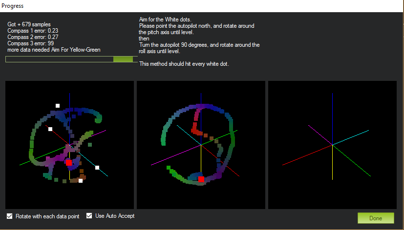
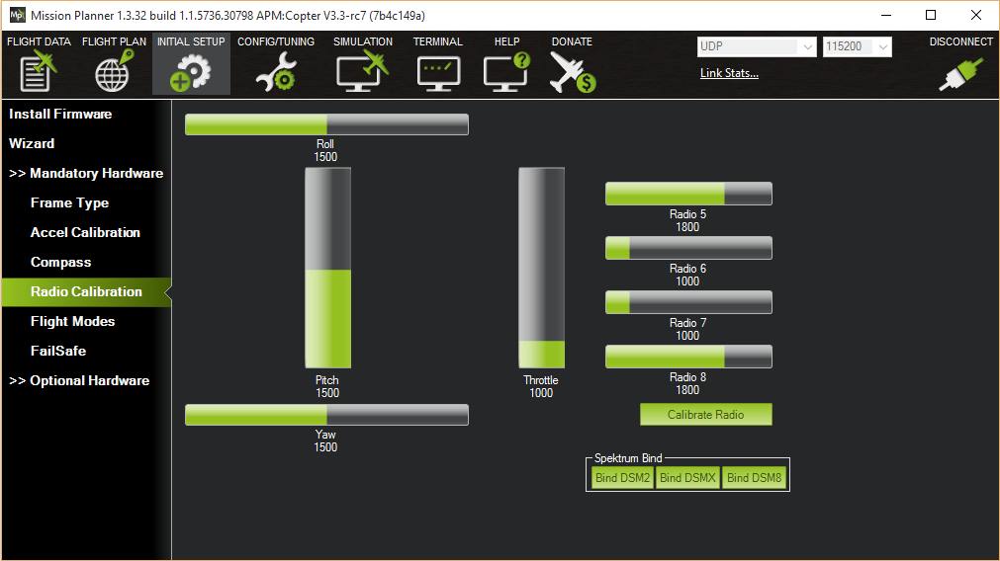
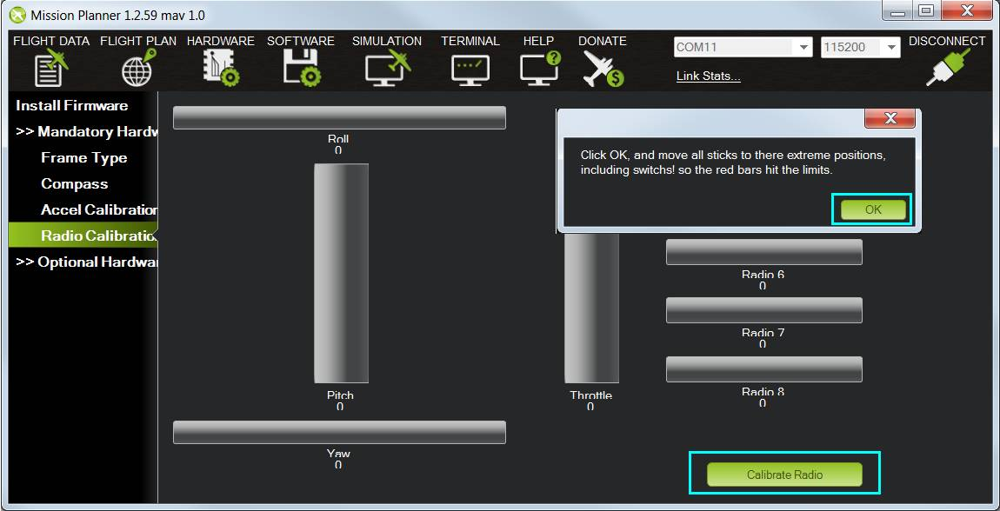
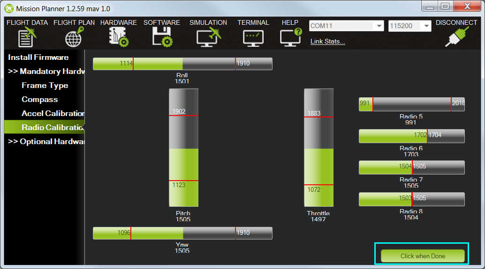
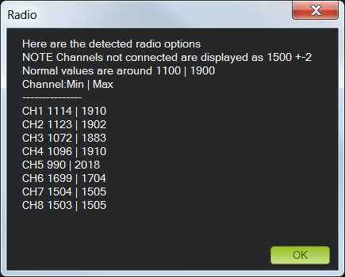

## Mission Planner Overview

*Mission Planner* is a full-featured ground station application for the ArduPilot open source autopilot project. This page contains information on the background of *Mission Planner* and the organization of this site.

### What is Mission Planner

*Mission Planner* is a ground control station for Plane, Copter and Rover. It is compatible with Windows only. *Mission Planner* can be used as a configuration utility or as a dynamic control supplement for your autonomous vehicle. 

## Installing Mission Planner

### Download the most recent Mission Planner installer file ###
Download the [latest Mission Planner installer from here](http://firmware.ardupilot.org/Tools/MissionPlanner/MissionPlanner-latest.msi).

### Run the installation utility
Open the Microsoft installer file (.msi) and select **Run** to run the installation utility.

Follow the instructions to complete the setup process. The installation utility will automatically install any necessary software drivers. If you receive a DirectX installation error, please update your DirectX plug-in from the DirectX Download Center.

If you receive the warning pictured here, select **Install this driver software anyway** to continue.

*Mission Planner* is normally installed in the **C:\Program Files (x86)\APM Planner** folder or the **C:\Program Files\APM Planner** folder. That is where your log files folder is located.

An icon to open the *Mission Planner* is created according to your instructions during the installation.

## Connect Mission Planner to DevKit

### Setting up the connection

To establish a connection you must first choose the communication method/channel you want to use, and then set up the physical hardware and Windows device drivers. You can connect the PC and DevKit using USB cables, Telemetry Radios, Bluetooth, IP connections etc.

>Note
>
>The driver for your connection hardware must be present on Windows as this makes your connection’s COM port and default data rate available to *Mission Planner*.

*Connection using SiK Radio from 3DR*

On *Mission Planner*, the connection and data rate are set up using the drop down boxes in the upper right portion of the screen.

Once you’ve attached the USB or Telemetry Radio, Windows will automatically assign your Devkit a COM port number, and that will show in the drop-down menu (the actual number does not matter). The appropriate data rate for the connection is also set (typically the USB connection data rate is 11520 and the radio connection rate is 57600).

Select the desired port and data rate and then press the Connect button to connect to the DevKit. After connecting *Mission Planner* will download parameters from the DevKit and the button will change to Disconnect as shown:

>Tip
>
>The “select port” dropdown also contains TCP or UDP port options that can be used to connect to an DevKit over a network.

### Troubleshooting

If *Mission planner* is unable to connect:

* Check that the correct baud rate is used for the selected method (115200 on USB or 57600 on Radio/Telemetry)
* If using a COM port on Windows, check that the connection’s COM port exists in the Windows Device Manager’s list of serial ports.
* If using a USB port, try a different physical USB port
* if using a UDP or TCP connection, check that your firewall is not blocking the IP traffic.

## Compass Calibration

### Calibration first steps

* UNDER **INITIAL SETUP | MANDATORY HARDWARE** SELECT **COMPASS**. 
* SELECT YOUR FLIGHT CONTROLER CONFIGURATION TO AUTOMATICALLY ENTER THE MOST IMPORTANT CONFIGURATION INFORMATION FOR YOUR BOARD:
	* For any modern flight controller (Pixhawk, NAVIO2, etc) select the button Pixhawk/PX4.
	* For APM 2.6, select APM with External Compass.
	
	

	*Mission Planner: Compass Calibration*

	You normally shouldn’t need to change any of the “General Compass Settings” or compass specific values (i.e. “Compass #1” section), but you might want to confirm that the **Enable compasses** and **Obtain declination automatically** boxes are checked.

	You may wish to disable Compass #2 (the internal compass) if you are seeing the dreaded “inconsistent compasses” pre-arm message often and you are sure that the external compass’s orientation is correct.

### Onboard Calibration

Copter-3.4 (and higher) supports “Onboard Calibration” meaning that the calibration routine runs on the flight controller. This method is more accurate than the older “Offboard Calibration” (aka “Live Calibration”) which runs on the ground station because in addition to offsets, scaling is also calculated.

To perform the onboard calibration:

* click the “Onboard Mag Calibration” section’s “Start” button

* if your flight controller has a buzzer attached you should hear a single tone followed by short beep once per second

* hold the vehicle in the air and rotate it so that each side (front, back, left, right, top and bottom) points down towards the earth for a few seconds in turn

	
        
* as the vehicle is rotated the green bars should extend further and further to the right until the calibration completes

* upon successful completion three rising tones will be emitted and a “Please reboot the autopilot” window will appear and you will need to reboot the DevKit before it is possible to arm the vehicle.

If calibration fails:

* you will hear a failure tone and the green bars may reset to the left and the calibration routine may restart (depending upon the ground station)
* if, after multiple attempts, you are unable to calibrate the compass, Press the “Cancel” button and change the “Fitness” drop-down to a more relaxed setting and try again.

### Offboard Calibration (aka “Live Calibration”)

To use this older method:

* Click the **Live Calibration** button.

	A window should pop-up showing you the state of the live calibration.

	
        
	*Mission Planner: Live Compass Calibration*

* The aim is to rotate the vehicle so that the coloured trail hits each of the white dots. One way to do this is to hold the vehicle in the air and rotate it slowly so that each side (front, back, left, right, top and bottom) points down towards the earth for a few seconds in turn.
	
	
 
     *Compass Calibration Positions (shown for Copter, but true for all vehicles)*

* The calibration will automatically complete when it has data for all the positions. At this point, another window will pop up telling you that it is saving the newly calculated offsets. These are displayed on the main screen below each associated compass.

## Accelerometer Calibration in Mission Planner

1. Under Initial Setup | Mandatory Hardware, select Accel Calibration from the left-side menu.
	
	   

    *Mission Planner: Calibrate Acceleration*

2. Click **Calibrate Accel** to start the calibration.

    *Mission Planner* will prompt you to place the vehicle each calibration position. Press any key to indicate that the DevKit is in position and then proceed to the next orientation.

    The calibration positions are: level, on right side, left side, nose down, nose up and on its back.

	

    *Accelerometer Calibration Positions (Copter)*

>Tip
>
>* It is important that the vehicle is kept still immediately after pressing the key for each step.
>* You may need to calibrate the board before it is mounted if the size/shape of the vehicle makes this difficult.
>* The level position is the most important to get right as this will be the attitude that your controller considers level while flying.

## Radio Control Calibration in Mission Planner

### Preconditions
#### Safety first

For safety reasons you should disconnect the battery and/or remove propellers before preforming radio calibration.

#### Centre trims

Centre trims in manual RC mode before preforming RC calibration. If trims are not centred you may need to do the RC calibration again after you have used the vehicle (this is easy to do at the field).

>Note
>
>Trims are centred when a moving vehicle does not change direction/speed/orientation when travelling hands-off with all controls/sticks in neutral positions. If there is any deviation in direction, speed or orientation, adjust the associated servo to compensate.
#### Connect DevKit and turn on receiver ####
Connect the DevKit via USB and turn on your RC transmitter. Verify that the transmitter is bound to the receiver (the receiver displays a solid green light) and that it is set to use the correct model for your vehicle.

Open *Mission Planner*’s **INITIAL SETUP | Mandatory Hardware | Radio Calibration** screen. If your RC receiver (Rx) and transmitter (Tx) are bound, you should see the green bars move when you move the transmitter sticks.

MissionPlanner: Radio Calibration Screen (Copter)

>Tip
>
>If the bars are not moving then check what LED lights the receiver is displaying:
>
>* no lights may indicate that it is incorrectly wired to the DevKit (look for connectors that may have been inserted upside down).
>* red or a flashing green light may indicate that your RC transmitter/receiver need be bound (see the manual that came with your RC equipment for instructions).
>* a solid green light recheck the DevKit is connected to the *Mission Planner* and if the bars are still not moving, try clicking on the **Calibrate Radio** button.

### Calibration steps

1. Open *Mission Planner*’s INITIAL SETUP | Mandatory Hardware | Radio Calibration screen.
2. Click on the green Calibrate Radio button in the lower right of the window.

	*Mission Planner* will display a prompt to check radio control equipment is on, battery is not connected, and propellers are not attached. Select **OK**.
	
	
    
    *Mission Planner: Select Calibrate Radio and OK to begin calibrating.*

3. Move the control sticks and toggle switches on your transmitter to their limits of travel and observe the results on the radio calibration bars. Red lines will appear across the calibration bars to indicate maximum and minimum values:

	

	*Mission Planner: Input range marked with red lines*

	>Tip
	>
	>**The green bars should move in the same direction as the**
	>
	>transmitter sticks (except for Pitch where the bars move opposite to stick movements - low values are forward, high values are back). If the green bars move in the wrong direction, reverse them using your RC transmitter’s channel-reverse function (see your RC gear’s manual for guidance).

	You should also calibrate the channel you have selected for controlling vehicle mode, and any other channels you have connected to the DevKit.

4. Select **Click when Done** when all required channels are set at the minimum and maximum positions.

    *Mission Planner* will show a summary of the calibration data. Normal values are around 1100 for minimums and 1900 for maximums.

	

    *Mission Planner: Radio Calibration Results*

5. Turn off your transmitter and disconnect the battery if it was connected.

