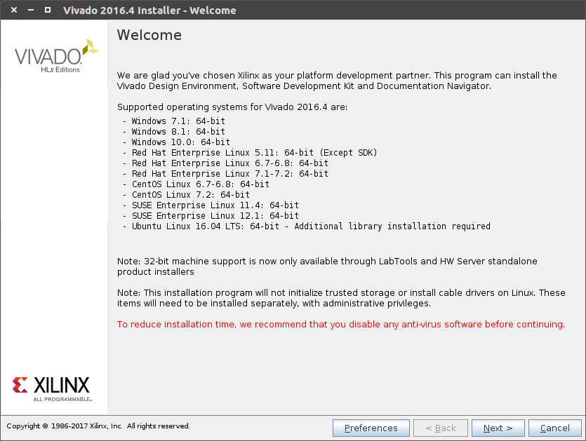
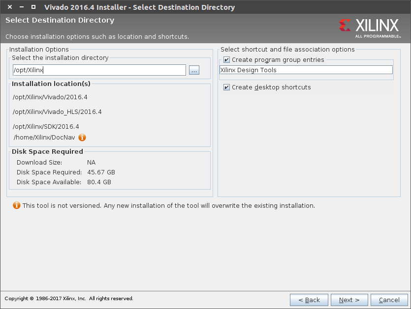
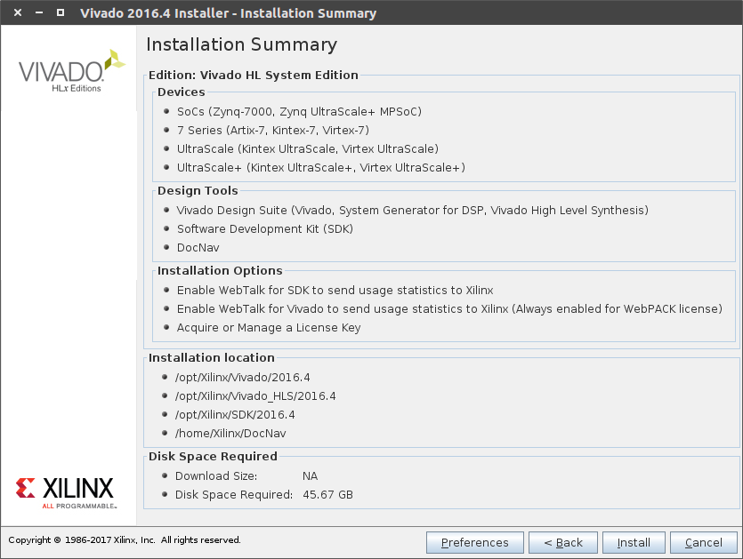
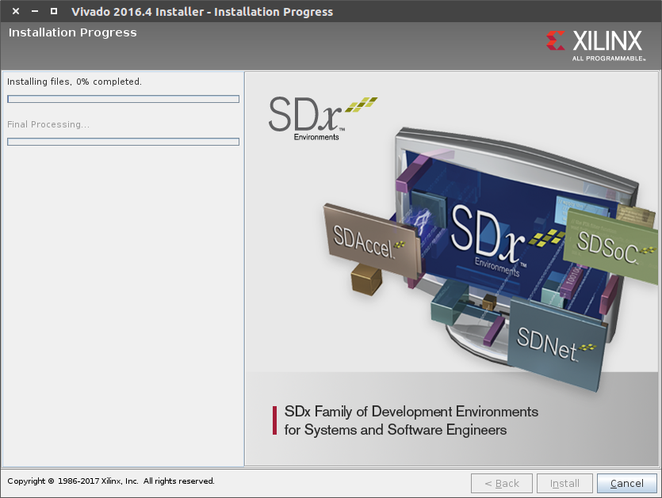
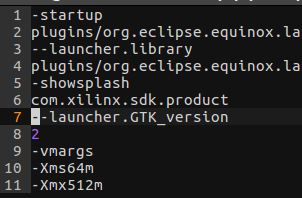

# DevKit Develop Enviroment For Ubuntu16.04

[TOC]

## 1.Install Vivado

### 1.1 Download

Our Vivado version is 2016.4 (Download here:https://www.xilinx.com/support/download.html)

Get Phenix Pro Devkit Firmware from github:

```
git clone https://github.com/RobSenseTech/PhenixPro_Devkit
```

### 1.2 Install Main Program  

First of all, we need to install **the latest version**(8u121) of Java SE Development Kit( Download here http://www.oracle.com/technetwork/java/javase/downloads/jdk8-downloads-2133151.html), then install it:

```
cd [your download path]
tar xf jdk-8u121-linux-x64.tar.gz
vim ~/.bashrc
```

add these statements:

```
export JAVA_HOME=[your jdk path]
export JRE_HOME=${JAVA_HOME}/jre
export CLASSPATH=.:{JAVA_HOME}/lib:${JRE_HOME}/lib
export PATH=${JAVA_HOME}/bin:$PATH
```

use this command to make it work:

```
source ~/.bashrc
```

to comfirm whether jdk is installed properly, use this command:

```
java -version
```

if JDK is installed properly, it will show these information:

```
java version "1.8.0_121"
Java(TM) SE Runtime Environment (build 1.8.0_121-b13)
Java HotSpot(TM) 64-Bit Server VM (build 25.121-b13, mixed mode)
```

now, we can install Vivado:

```
cd [your vivado path]
tar xf Xilinx_Vivado_SDK_2016.4_0124_1.tar.gz
cd Xilinx_Vivado_SDK_2016.4_0124_1
sudo ./xsetup
```

click Next



select three "I Agree" and Next


select third one, click Next


select "Software Development Kit (SDK)", click Next


choose installation directory, click Next



click install






after this, we need to load the license:


click "Load License" and "Copy License" (You can find lic file in firmware path [phenix_devkit path]/amp_system/)

<div align=center>

</div>

select your license and click open.

the last step, you need to add some enviroment parameter in **.bashrc**:

```
source /opt/Xilinx/Vivado/2016.4/settings64.sh
source /opt/Xilinx/SDK/2016.4/settings64.sh
export PATH=$PATH:/opt/Xilinx/SDK/2016.4/bin
```

### 1.3 Install cable driver

On Windows, Install Cable Drivers is an optional selection in the installer.For Linux, because root or sudo access is required to install drivers, this option has been removed from the Linux installer beginning in Vivado 2015.4. The general Vivado installer can now be run on Linux without root or sudo privileges. To install cable drivers on Linux, there is now a script that must be run as root or sudo post installation.

Script Location: <Vivado Install Dir>/data/xicom/cable_drivers/lin64/install_script/install_drivers/
Script Name: install_drivers

**Reference: ug973-vivado-release-notes-install-license**

### 1.4 Add Vivado SDK to Dash

After steps from 1.1 to 1.3, Vivado SDK has been installed successfully, but in x64 ubuntu, we still cannot find vivado in Dash, so we have to add it by ourselves:

For Vivado:

```
sudo touch /usr/share/applications/vivado.desktop
sudo vim /usr/share/applications/vivado.desktop
```

add these statement:

```
[Desktop Entry]
Encoding=UTF-8
Name=Vivado 2016.4
Exec=[Vivado Install Dir]/Vivado/2016.4/bin/vivado
Terminal=false
Type=Application
Icon=[Vivado Install Dir]/Vivado/2016.4/doc/images/vivado_logo.png
StartupNotify=true
Categories=System;
```

For SDK:

```
cd [Vivado Install Dir]/SDK/2016.4/eclipse/lnx64.o/
sudo mkdir jre
cd jre
sudo ln -s [your jdk path]/jre/bin
sudo touch /usr/share/applications/xsdk.desktop
sudo vim /usr/share/applications/xsdk.desktop
```

add these statement:

```
[Desktop Entry]
Encoding=UTF-8
Name=SDK 2016.4
Exec=xsdk
Terminal=false
Type=Application
Icon=[Vivado Install Dir]/SDK/2016.4/data/sdk/images/sdk_logo.png
StartupNotify=true
Categories=System;
```

**Note: **

**When launch SDK in Dash, it shows this error, it means you have to launch sdk with shell command "xsdk", otherwise, you may find that you can't close SDK**:

<div align=center>

</div>

**If you launch SDK in terminal with command "xsdk", and there nothing happens, but shows information as follow:**

```
****** Xilinx Software Development Kit
****** SDK v2016.4 (64-bit)
  **** SW Build 1733598 on Wed Dec 14 22:35:42 MST 2016
    ** Copyright 1986-2016 Xilinx, Inc. All Rights Reserved.

Launching SDK with command /opt/Xilinx/SDK/2016.4/eclipse/lnx64.o/eclipse -vmargs -Xms64m -Xmx512m -Dorg.eclipse.swt.internal.gtk.cairoGraphics=false
```

**then, you need to add these 2 lines to [Vivado Install Dir]/SDK/2016.4/eclipse/lnx64.o/eclipse.ini before statement "-vmargs"**

```
--launcher.GTK_version
2
```

**just like this:**

<div align=center>

</div>
****
